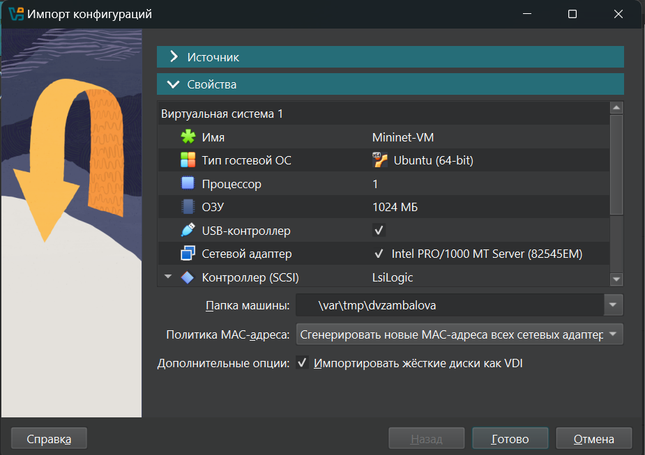
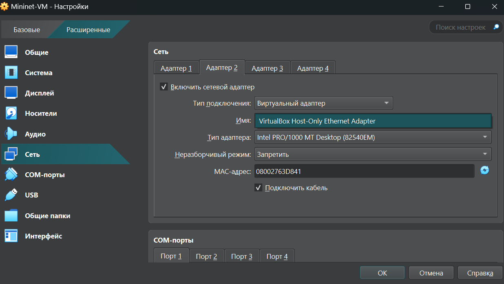
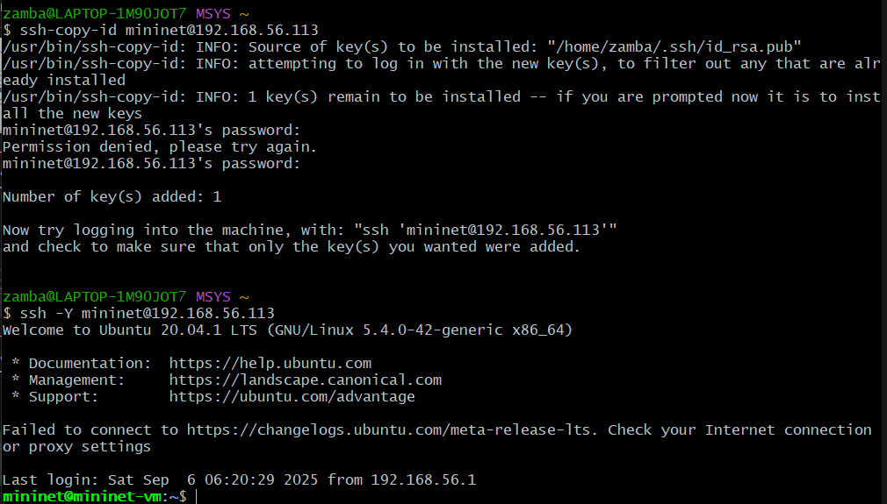
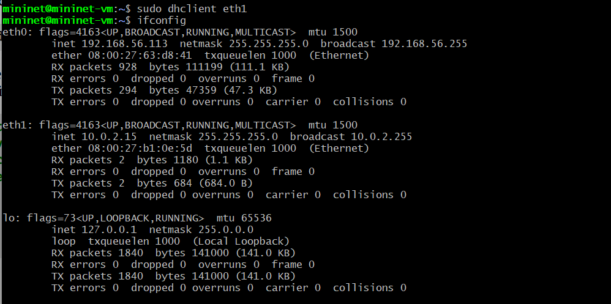

# Информация

## Докладчик

:::::::::::::: {.columns align=center}
::: {.column width="70%"}

  * Замбалова Дина Владимировна
  * студентка
  * Российский университет дружбы народов
  * [1132226536@pfur.ru](mailto:1132226536@pfur.ru)
  * <https://github.com/dvzambalova>

:::
::: {.column width="25%"}

:::
::::::::::::::

# Цель работы

Основная цель работы — подготовить рабочее пространство и инструментарий для
работы с языком программирования Julia, на простейших примерах познакомиться
с основами синтаксиса Julia.

# Задание

1. Установите под свою операционную систему Julia, Jupyter.
2. Используя Jupyter Lab, повторите примеры из раздела лабораторной работы.
3. Выполните задания для самостоятельной работы.

# Выполнение лабораторной работы

{#fig:001 width=70%}

# Простейшие примеры на Julia

{#fig:002 width=60%}

# Простейшие примеры на Julia

{#fig:003 width=60%}

# Простейшие примеры на Julia

{#fig:004 width=40%}

# Задание №1

{#fig:005 width=40%}

# Задание №1

{#fig:006 width=60%}

# Задание №1

{#fig:007 width=30%}

# Задание №1

{#fig:008 width=50%}

# Задание №2

{#fig:009 width=70%}

# Задание №2

{#fig:010 width=70%}

# Задание №3

{#fig:011 width=40%}

# Задание №3

{#fig:012 width=25%}

# Задание №4

{#fig:013 width=40%}

# Задание №4

{#fig:014 width=25%}

# Выводы

В результате выполнения данной лабораторной работы я подготовила рабочее пространство и инструментарий для
работы с языком программирования Julia, на простейших примерах познакомилась
с основами синтаксиса Julia.

# Список литературы

1. JuliaLang [Электронный ресурс]. 2025 JuliaLang.org contributors. URL: https://julialang.org/ (дата обращения: 06.10.2025).
2. Julia 1.11 Documentation [Электронный ресурс]. 2025 JuliaLang.org contributors. URL: https://docs.julialang.org/en/v1/ (дата обращения: 06.10.2025).

# {.standout}

Спасибо за внимание!
