---
## Front matter
title: "Лабораторная работа №1"
subtitle: "Введение в Mininet"
author: "Замбалова Дина Владимировна"

## Generic otions
lang: ru-RU
toc-title: "Содержание"

## Bibliography
bibliography: bib/cite.bib
csl: pandoc/csl/gost-r-7-0-5-2008-numeric.csl

## Pdf output format
toc: true # Table of contents
toc-depth: 2
lof: true # List of figures
lot: false # List of tables
fontsize: 12pt
linestretch: 1.5
papersize: a4
documentclass: scrreprt
## I18n polyglossia
polyglossia-lang:
  name: russian
  options:
	- spelling=modern
	- babelshorthands=true
polyglossia-otherlangs:
  name: english
## I18n babel
babel-lang: russian
babel-otherlangs: english
## Fonts
mainfont: PT Serif
romanfont: PT Serif
sansfont: PT Sans
monofont: PT Mono
mainfontoptions: Ligatures=TeX
romanfontoptions: Ligatures=TeX
sansfontoptions: Ligatures=TeX,Scale=MatchLowercase
monofontoptions: Scale=MatchLowercase,Scale=0.9
## Biblatex
biblatex: true
biblio-style: "gost-numeric"
biblatexoptions:
  - parentracker=true
  - backend=biber
  - hyperref=auto
  - language=auto
  - autolang=other*
  - citestyle=gost-numeric
## Pandoc-crossref LaTeX customization
figureTitle: "Рис."
tableTitle: "Таблица"
listingTitle: "Листинг"
lofTitle: "Список иллюстраций"
lotTitle: "Список таблиц"
lolTitle: "Листинги"
## Misc options
indent: true
header-includes:
  - \usepackage{indentfirst}
  - \usepackage{float} # keep figures where there are in the text
  - \floatplacement{figure}{H} # keep figures where there are in the text
---

# Цель работы

Основной целью работы является развёртывание в системе виртуализации
(например, в VirtualBox) mininet, знакомство с основными командами для работы с Mininet через командную строку и через графический интерфейс.

# Теоретическое введение

Mininet[@mininet] -- это эмулятор компьютерной сети. Под компьютерной сетью подразумеваются простые компьютеры — хосты, коммутаторы, а так же OpenFlow-контроллеры. С помощью простейшего синтаксиса в примитивном интерпретаторе команд можно разворачивать сети из произвольного количества хостов, коммутаторов в различных топологиях и все это в рамках одной виртуальной машины(ВМ). На всех хостах можно изменять сетевую конфигурацию, пользоваться стандартными утилитами(ifconfig, ping) и даже получать доступ к терминалу. На коммутаторы можно добавлять различные правила и маршрутизировать трафик.

Mininet создает реалистичную виртуальную сеть, выполняя реальный код ядра, коммутатора и приложения на одной машине (VM, облачной или собственной) за считанные секунды с помощью одной команды `sudo mn`. 

# Выполнение лабораторной работы

Перейдем в репозиторий Mininet, скачаем актуальный релиз ovf-образа виртуальной машины.
Запустим систему виртуализации и импортируем файл .ovf и укажем параметры импорта (рис. [-@fig:001];[-@fig:002]).

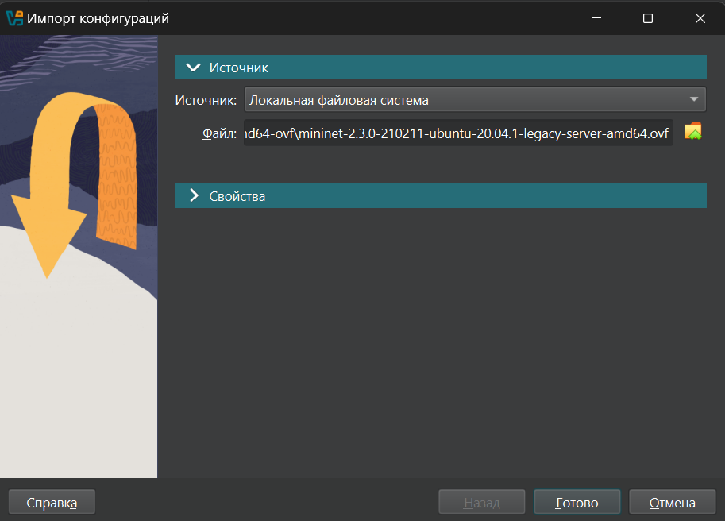{#fig:001 width=70%}

{#fig:002 width=70%}

Перейдем в настройки системы виртуализации и уточним параметры
настройки виртуальной машины. В частности, для VirtualBox выберем импортированную виртуальную машину и перейдите в меню "Машина -> Настроить".
Перейдем к опции «Система». Если внизу этого окна есть сообщение об
обнаружении неправильных настроек, то, следуя рекомендациям, внесем исправления (изменим тип графического контроллера на рекомендуемый).
В настройках сети первый адаптер должен иметь подключение типа
NAT (рис. [-@fig:003]). Для второго адаптера укажите тип подключения host-only network adapter
(виртуальный адаптер хоста), который в дальнейшем вы будете использовать для входа в образ виртуальной машины (рис. [-@fig:004]).

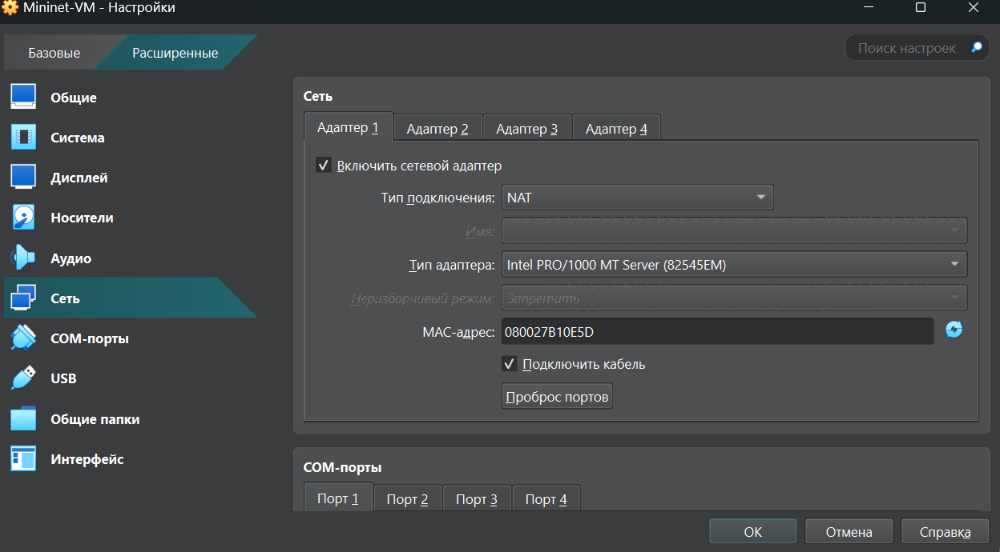{#fig:003 width=70%}

{#fig:004 width=70%}

Запустим виртуальную машину с Mininet.
Залогинимся в виртуальную машину:
- login: mininet
- password: mininet

Посмотрите адрес машины с помощью `ifconfig` (рис. [-@fig:005]).

{#fig:005 width=70%}

Подключимся к виртуальной машине (из терминала хостовой машины).
Настроем ssh-подсоединение по ключу к виртуальной машине. Вновь подключимся к виртуальной машине и убедимся, что подсоединение
происходит успешно и без ввода пароля (рис. [-@fig:006]).

{#fig:006 width=70%}

После подключения к виртуальной машине mininet посмотрим IP-адреса
машины. Активен только внутренний адрес машины вида 192.168.x.y, поэтому активируем второй интерфейс (рис. [-@fig:007]).

{#fig:007 width=70%}

Для удобства дальнейшей работы добавим для mininet указание на использование двух адаптеров при запуске. Для этого требуется перейти
в режим суперпользователя и внести изменения в файл /etc/netplan/01-
netcfg.yaml виртуальной машины mininet.
В результате файл /etc/netplan/01-netcfg.yaml должен иметь следующий вид  (рис. [-@fig:008]).

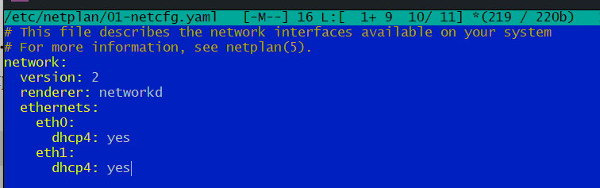{#fig:008 width=70%}

В виртуальной машине mininet переименуем предыдущую установку Mininet.
Скачаем новую версию Mininet.
Обновим исполняемые файлы (рис. [-@fig:009]).

{#fig:009 width=70%}

Проверим номер установленной версии mininet (рис. [-@fig:010]).

{#fig:010 width=70%}

При попытке запуска приложения из-под суперпользователя возникает ошибка:
`X11 connection rejected because of wrong authentication`.
Ошибка возникает из-за того, что X-соединение выполняется от имени пользователя mininet, а приложение запускается от имени пользователя root
с использованием sudo. Для исправления этой ситуации необходимо заполнить файл полномочий /root/.Xauthority, используя утилиту xauth.
Скопируем значение куки (MIT magic cookie)1 пользователя mininet в файл
для пользователя root (рис. [-@fig:011]).

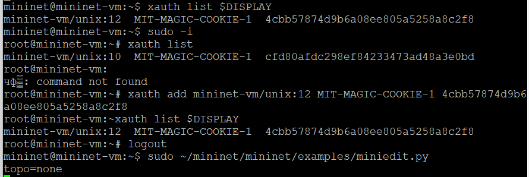{#fig:011 width=70%}

Для запуска минимальной топологии введем в командной строке (рис. [-@fig:012]):
`sudo mn`.
Эта команда запускает Mininet с минимальной топологией, состоящей из
коммутатора, подключённого к двум хостам.
Для отображения списка команд интерфейса командной строки Mininet
и примеров их использования введем команду в интерфейсе командной
строки Mininet:
`help`
Для отображения доступных узлов введем:
`nodes`
Вывод этой команды показывает, что есть два хоста (хост h1 и хост h2)
и коммутатор (s1).
Иногда бывает полезно отобразить связи между устройствами в Mininet,
чтобы понять топологию. Введем команду net в интерфейсе командной
строки Mininet, чтобы просмотреть доступные линки:
`net`
Вывод этой команды показывает:
- Хост h1 подключён через свой сетевой интерфейс h1-eth0 к коммутатору на интерфейсе s1-eth1.
- Хост h2 подключён через свой сетевой интерфейс h2-eth0 к коммутатору на интерфейсе s1-eth2.
- Коммутатор s1:
  - имеет петлевой интерфейс lo.
  - подключается к h1-eth0 через интерфейс s1-eth1.
  - подключается к h2-eth0 через интерфейс s1-eth2.

{#fig:012 width=70%}

Mininet позволяет выполнять команды на конкретном устройстве. Чтобы
выполнить команду для определенного узла, необходимо сначала указать
устройство, а затем команду, например: `h1 ifconfig`

Эта запись выполняет команду ifconfig на хосте h1 и показывает интерфейсы хоста h1 — хост h1 имеет интерфейс h1-eth0, настроенный
с IP-адресом 10.0.0.1, и другой интерфейс lo, настроенный с IP-адресом
127.0.0.1 (рис. [-@fig:013]).

{#fig:013 width=70%}

Посмотрим конфигурацию всех узлов (рис. [-@fig:014]).

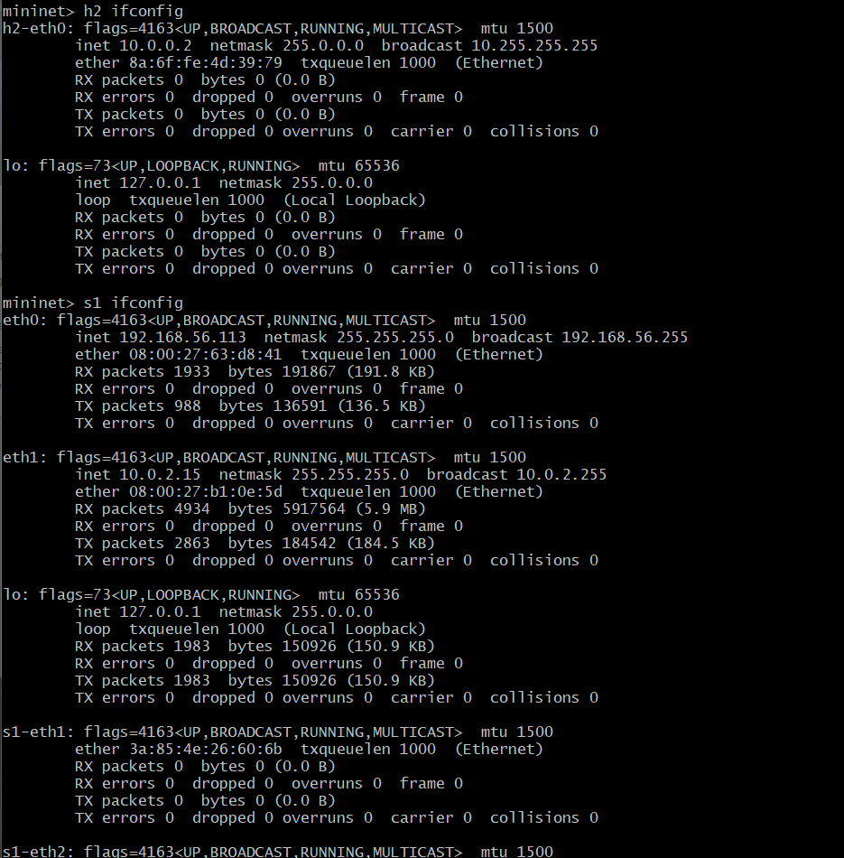{#fig:014 width=70%}

По умолчанию узлам h1 и h2 назначаются IP-адреса 10.0.0.1/8 и
10.0.0.2/8 соответственно. Чтобы проверить связь между ними,
используем команду `ping`. Команда `ping` работает, отправляя сообщения
эхо-запроса протокола управляющих сообщений Интернета (ICMP) на удалённый компьютер и ожидая ответа.
Например, команда
`h1 ping 10.0.0.2`
проверяет соединение между хостами h1 и h2 (рис. [-@fig:015]). 

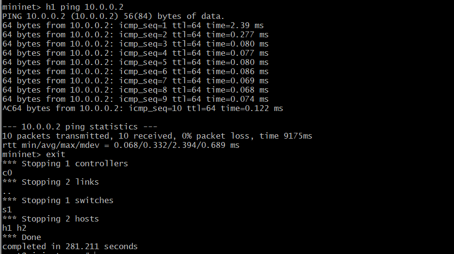{#fig:015 width=70%}

Очистим предыдущий экземпляр Mininet (рис. [-@fig:016]).

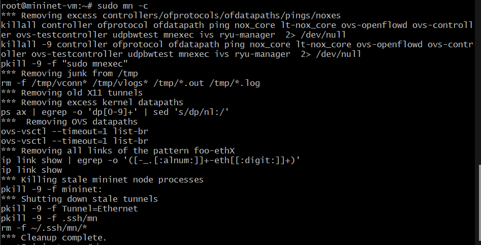{#fig:016 width=70%}

По умолчанию XTerm использует растровые шрифты малого кегля. Для увеличения размера шрифта и применения векторных шрифтов вместо растровых необходимо внести изменения в файл /etc/X11/app-defaults/XTerm. Для этого можно воспользоваться следующей командой: sudo mcedit /etc/X11/app-defaults/XTerm
и затем в конце файла добавить строки:
xterm*faceName: Monospace, xterm*faceSize: 12
Здесь выбран системный моноширинный шрифт, кегль шрифта — 12 пунктов (рис. [-@fig:017]).

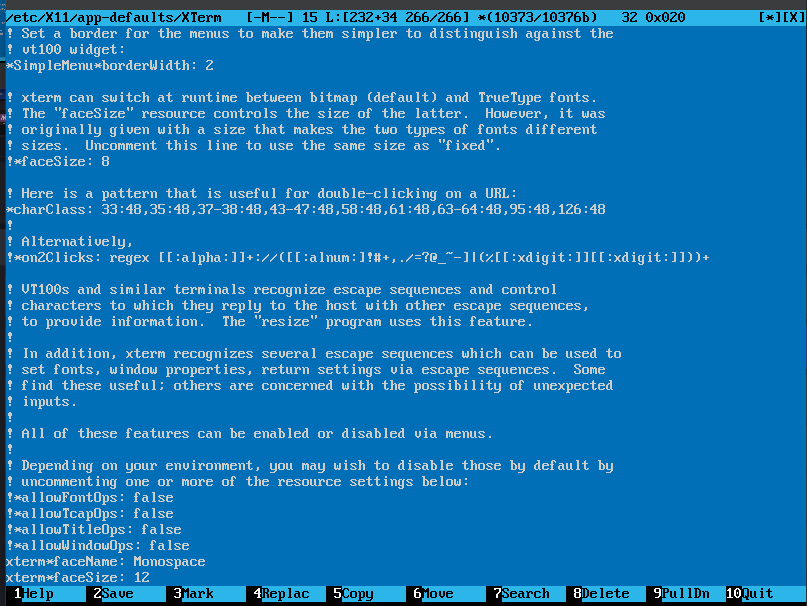{#fig:017 width=70%}

Запустим Xserver. Выберем опции: multiple windows, display number: -1, start no client. Сохраним параметры, тогда при следующем запуске не нужно будет отмечать эти опции (рис. [-@fig:018]).

{#fig:018 width=70%}

Запустим putty. При подключении добавим опцию перенаправления X11 (рис. [-@fig:019];[-@fig:020]).

{#fig:019 width=70%}

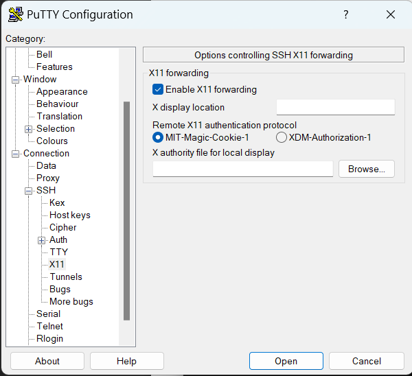{#fig:020 width=70%}

В терминале виртуальной машины mininet запустим MiniEdit: sudo
~/mininet/mininet/examples/miniedit.py. 

Добавим два хоста и один коммутатор, соединим хосты с коммутатором (рис. [-@fig:021]). Настроим IP-адреса на хостах h1 и h2. Для этого удерживая правую кнопку
мыши на устройстве выберем свойства. Для хоста h1 укажем IP-адрес 10.0.0.1/8, а для хоста h2— 10.0.0.2/8(рис. [-@fig:022]).

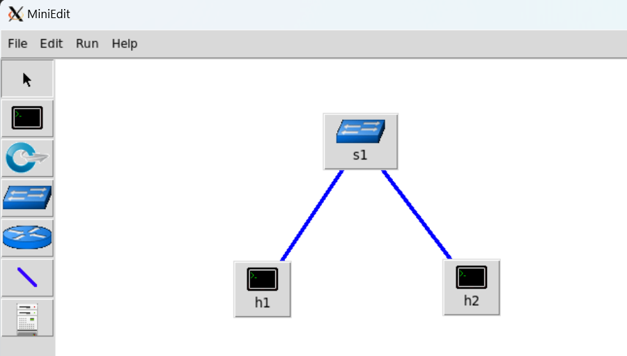{#fig:021 width=70%}

{#fig:022 width=70%}

Перед проверкой соединения между хостом h1 и хостом h2 необходимо запустить эмуляцию. Для запуска эмуляции нажмём кнопку Run. После начала эмуляции кнопки панели MiniEdit стали серыми, указывая на то, что в настоящее время они отключены.
Откроем терминал на хосте h2. На терминале хоста h1 введём команду ifconfig, чтобы отобразить назначенные ему IP-адреса. Интерфейс h1-eth0 на хосте h1 настроен с IP-адресом 10.0.0.1 и маской подсети 255.0.0.0.Повторим этидействия на хосте h2. Его интерфейс h2-eth0 настроен с IP-адресом 10.0.0.2 и маской подсети 255.0.0.0. Проверим соединение между хостами, введя в терминале хоста h2
команду ping 10.0.0.1. Для остановки теста нажмём Ctrl + c. Остановим эмуляцию, нажав кнопку Stop (рис. [-@fig:023]).

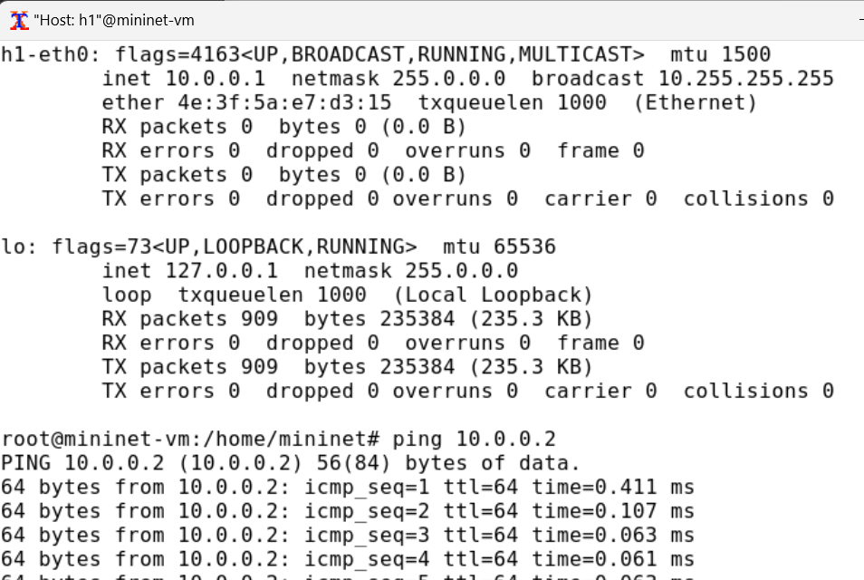{#fig:023 width=70%}

Ранее IP-адреса узлам h1 и h2 были назначены вручную. В качестве альтернативы можно полагаться на Mininet для автоматического назначения IP-адресов. Для этого удалим назначенный вручную IP-адрес с хостов h1 и h2. В MiniEdit нажмём Edit Preferences. По умолчанию в поле базовые значения IP-адресов (IP Base) установлено 10.0.0.0/8. Изменим это значение на 15.0.0.0/8. Затем запустим
эмуляцию, нажав кнопку Run (рис. [-@fig:024]).

{#fig:024 width=70%}

Откроем терминал на хосте h1, удерживая правую кнопку мыши на хосте h1 и выбрав Terminal. Отобразим IP-адреса, назначенные хосту h1.Интерфейс h1-eth0 на узле h1 теперь имеет IP-адрес 15.0.0.1 и маску подсети 255.0.0.0(рис. [-@fig:025])

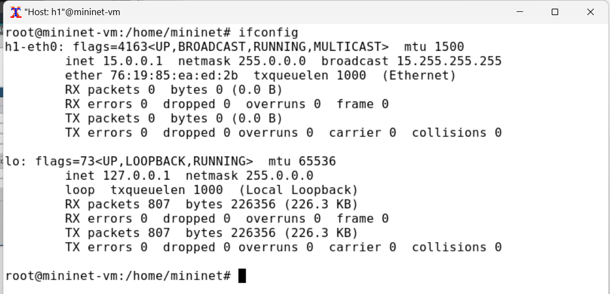{#fig:025 width=70%}

В домашнем каталоге виртуальной машины mininet создадим каталог для работы с проектами mininet: mkdir ~/work.
Для сохранения топологии сети в файл нажмём в MiniEdit “File”-“Save”. Укажем имя для топологии и сохраним на своём компьютере (рис. [-@fig:026]).

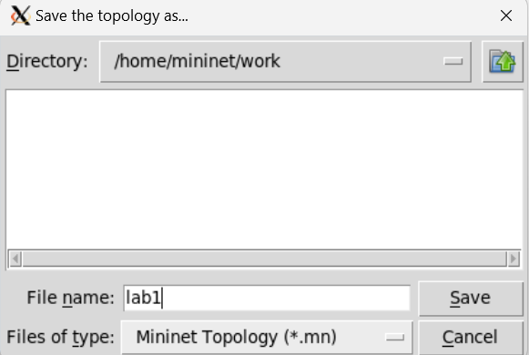{#fig:026 width=70%}

После сохранения проекта поменяем права доступа к файлам в каталоге проекта (рис. [-@fig:027]).

{#fig:027 width=70%}

# Выводы

В результате выполнения данной лабораторной работы я развёрнула mininet в системе виртуализации
VirtualBox, а также ознакомилась с основными командами для работы с Mininet через командную строку и через графический интерфейс.

# Список литературы{.unnumbered}

::: {#refs}
:::